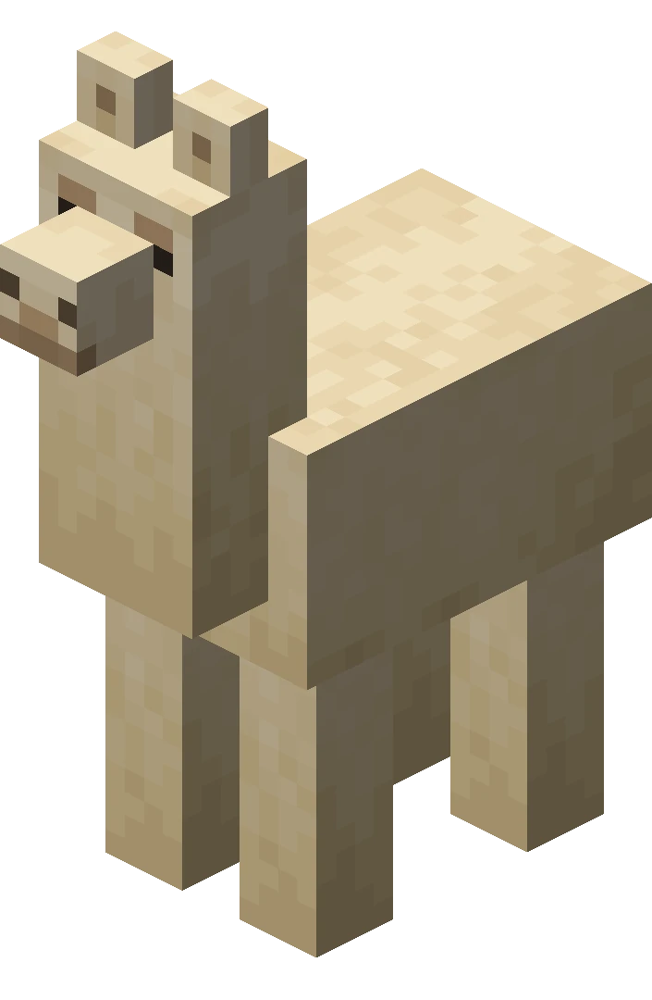

# Introduction

Llamarama is a mod that expands the world of llamas.

Have you ever felt like minecraft [llamas](https://minecraft.fandom.com/wiki/Llama) were left behind
and are kind of uninteresting? Well, so did we, and we decided to fix them.

        

Not only that, but we've also added even more llamas, because you can never have enough llamas, am I right?

There's no special preparation required for you to do.
You just need to explore the world until you find one of our mobs.
