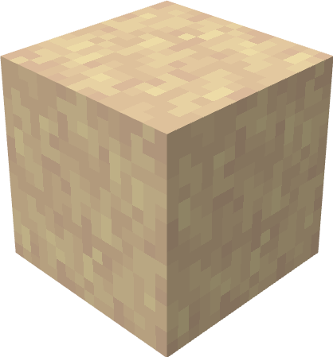
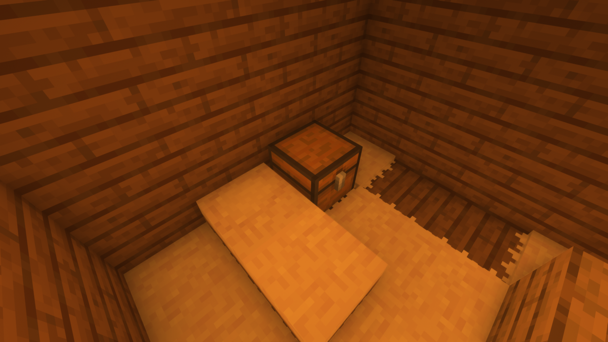

# Llama Wool

A new type of wool that you get from shearing [woolly llamas](/docs/mobs/woolly-llama)

    

You can create a bed and a carpet out of it. However, this rough carpet would scratch the back
of a llama; therefore, it's not a good idea to place it on them...

    

