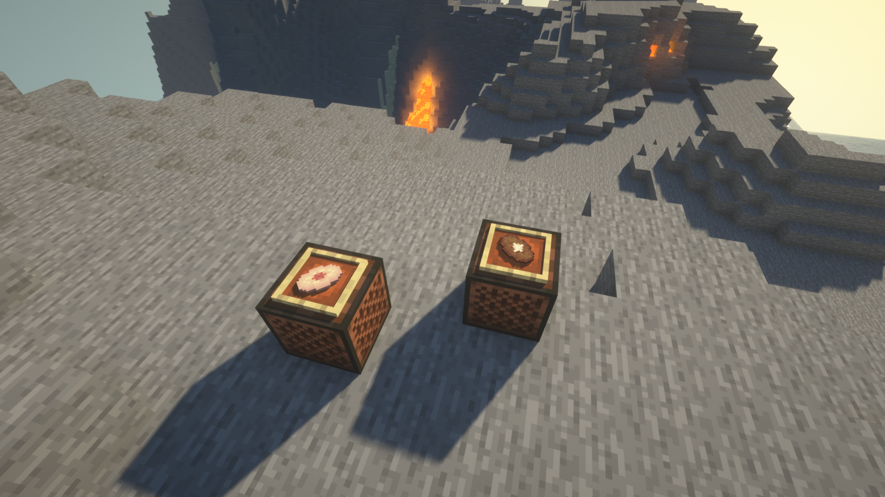

# Music Discs

A unique element of this mod is the [music discs](https://minecraft.fandom.com/wiki/Music_Disc)
that it adds.

A new music disc has been added for every llama variant.
You can check out the songs [here](https://soundcloud.com/digital-pear-gaming/sets/llamarama-soundtrack)

However, we do suggest trying to get the songs in-game. For that you can try finding a
[caravan trader](/docs/mobs/caravan-trader), who will trade for them. Well, whatever you do,
do NOT attempt to feed metals to animals... it's a really bad idea. At least the vet told me so...

    

