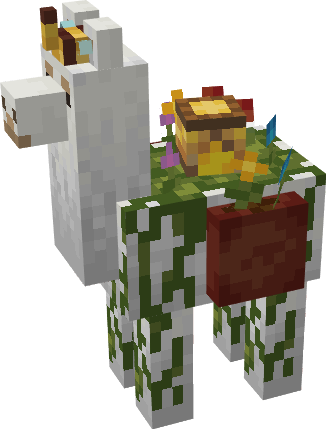

# Bumble Llama

----------------------------------------------

Is that flowers I smell?? Indeed, it is! This llama has evolved to co-exist with nature
and has a deep love for flowers. It spawns naturally in the
[flower forest biome](https://minecraft.fandom.com/wiki/Forest#Flower_Forest)
and is friends with bees. Do NOT attack it near bees, you will regret it.

 

    

 

Also, because of its close relationship to bees, it is able to make bees polinate
if they are close to it and bees also store some of their nectar on the hive that they built
on its back.

You cannot ride this llama, since you would destroy the hive and no-one wants that. You could
also try bone-mealing this llama and from what I've heard from researchers, it can create plants!
Even without your assistance, this llama will spread life around it when it moves.
