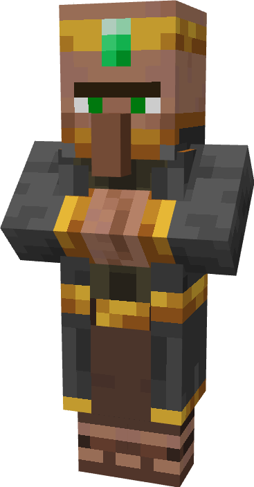

# Caravan Trader

---------------------------

A new [wandering trader like](https://minecraft.fandom.com/wiki/Wandering_Trader) mob, with the same kind
of spawning behavior. However, this one has a deep relation to his llamas. Unlike normal merchants, this one has
a lot of llamas that come with him on a caravan.

        

He has some useful (sometimes not) deals, that you may not want to lose!

Another difference between the wandering trader and the caravan trader is that the caravan trader never leaves.
He'll stay with you as long as you allow him to.
