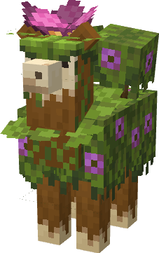

# Mossy Llama

------------------------

Unlike the [bumble llama](/docs/mobs/bumble-llama) that found its home in the flower forests,
this llama went deep underground where and made the [lush caves](https://minecraft.fandom.com/wiki/Lush_Caves)
it's home.

The underground growth of those caves, crept up on the llama and slowly mutated it. That lead
to the creation of a new species, which is able to spread lush growth, grow azalea trees, camouflage itself
in moss and also imitate the effect of a [spore blossom](https://minecraft.fandom.com/wiki/Spore_Blossom)

 

    

 

You cannot ride this llama, because it has some azalea growing on it's back; however, shearing it
will give you many different kinds of underground plants. They also have the evolutionary trait of being
unable to breed, as they are quite unsocial creatures. You won't find more than 4 spawning close to one
another even in the same cave.

PS: [Caravan traders](/docs/mobs/caravan-trader) have trained Mossy Llamas to not spread moss around when
moving, because it constantly interrupted their walking.
