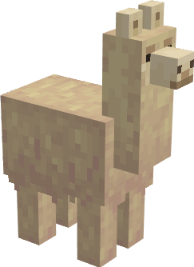

# Woolly Llama

----------------------------------------------

People say it's an alpaca... nahh. It is a new variety of llama
that spawns in [mountains](https://minecraft.fandom.com/wiki/Mountains)

Over the years llamas evolved, so that they can survive the cold winter nights in the mountains.

This new fluffy friend can be sheared and can also be bred to create more new friends.
This llama can also be ridden and carry a chest, like normal llamas!

 

    

